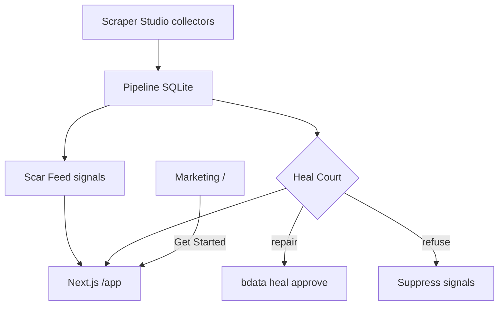

# Wolverine · Scar Feed

Restock radar for niche electronics that will not cry wolf when the scraper is lying.

Hobby stores like Adafruit, SparkFun, Pimoroni, and The Pi Hut change their pages all the time. Most scrapers break quietly and then start inventing prices or stock. Wolverine watches those stores with Bright Data Scraper Studio, turns the raw product data into plain-English restock signals (Scar Feed), and puts a gate in front of anything that looks broken (Heal Court). If a scrape looks wrong, the feed stays quiet until Studio is healed — so you do not get a fake “back in stock” alert.

**Try it live:** [wolverine-scraper.vercel.app](https://wolverine-scraper.vercel.app/) · [in-app docs](https://wolverine-scraper.vercel.app/docs) · [deploy notes](docs/DEPLOY.md)

## What you will see

Open the site, then go into **`/app`**. That is the working product: a live Field Console at the top, Scar Feed signals, Heal Court for each store, a catalog of latest prices, a heal journal, and a Studio page that lists the four collectors. The marketing homepage is just the story; the app is where the scrape loop shows up.

You can also pull the same dashboard as a Docker image if you want it on your machine — details are in [CONTRIBUTING.md](CONTRIBUTING.md) and [docs/DEPLOY.md](docs/DEPLOY.md).

## How Bright Data Scraper Studio is used

We did not hand-write CSS selectors for these stores. For each shop we pointed Bright Data’s Scraper Studio CLI at a real category page and asked it to pull product name, price, stock, and URL. Studio created four custom collectors (their IDs are pinned in the table below — we keep reusing them; we do not recreate scrapers every time).

When a run finishes, the pipeline drops structured rows into a SQLite database. From there we build Scar Feed: short sentences about scarcity, deals, and restocks. Before those sentences go out, Heal Court looks for red flags — empty prices, cloned stock text, that kind of thing. If a store looks healthy, Court **releases** the data. If something is wrong, Court can **repair** by asking Studio to heal the collector, then approving and re-running it. If a heal preview still looks fake, Court **refuses** and that store’s signals stay suppressed until the next honest scrape.

All of that heavy lifting (login to Bright Data, run, heal, approve) happens in GitHub Actions on a schedule, not inside the public website. After each job we export a snapshot file the demo can read. On the live site, `/app` polls that snapshot so the feed and court stay current. Judges can hit **Run field scrape** to kick the Actions workflow; Bright Data’s API key never sits on Vercel.

Sample scrape output lives in [`examples/sample-output.json`](examples/sample-output.json). Every real heal attempt is written down in [`heal-log.md`](heal-log.md).

## Collectors (do not recreate)

| Store | Collector | Listing URL |
| --- | --- | --- |
| Adafruit | `c_msyvm0ar1gznj2dlrq` | https://www.adafruit.com/category/105 |
| SparkFun | `c_msywbl7b18fsthmxn` | https://www.sparkfun.com/development-boards/single-board-computers/raspberry-pi.html |
| Pimoroni | `c_msywj65f19rulm4cua` | https://shop.pimoroni.com/collections/raspberry-pi |
| The Pi Hut | `c_msyx5sb61lfwvvvspd` | https://thepihut.com/collections/raspberry-pi |

## Where to go next

- Want to run or change the code? Start with **[CONTRIBUTING.md](CONTRIBUTING.md)**.
- Shipping the site or wiring secrets? See **[docs/DEPLOY.md](docs/DEPLOY.md)**.
- Keys, reporting bugs that involve secrets: **[SECURITY.md](SECURITY.md)**.

## AI assistance

Cursor helped write a lot of the pipeline, Scar Feed, heal loop, CI, and UI. Store choice, collector IDs, heal prompts, and what “good” looks like for a scrape were directed by the author.
