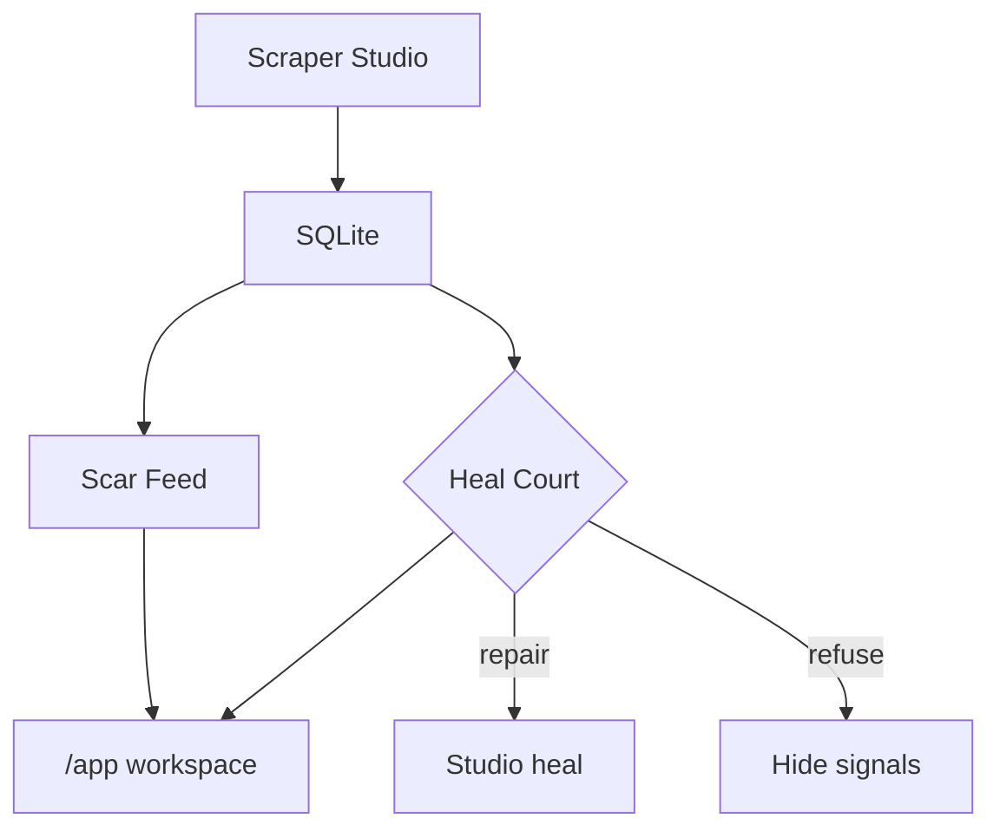

# Wolverine · Scar Feed

Restock radar for niche electronics that will not cry wolf when the scraper is lying.

**Live demo:** [wolverine-scraper.vercel.app](https://wolverine-scraper.vercel.app/) 

**Demo video:** [Demo video](https://youtu.be/_UDIV9uMk5I)

## The problem

Hobby electronics shops (Adafruit, SparkFun, Pimoroni, The Pi Hut) change their pages often. A normal scraper breaks, keeps running anyway, and starts showing wrong prices or stock. If you build restock alerts on that, you get false alarms the scraper is lying, and you cry wolf.

## What this app does

Wolverine scrapes those four stores, stores the product data, and turns it into a simple feed of restock / scarcity / deal signals (**Scar Feed**).

Before anything goes out, **Heal Court** checks whether a store’s scrape still looks honest. If it does, the feed speaks. If it does not, that store stays quiet until Bright Data Scraper Studio heals the collector. So a broken scrape cannot invent a “back in stock.”

Open **`/app`** on the live site for the real product: Field Console, Feed, Heal Court, Catalog, heal journal, and Studio. The homepage is the story; `/app` is the working tool.

## How we use Bright Data Scraper Studio

We use Bright Data’s Scraper Studio — not hand-written CSS selectors, and not their big prebuilt store library. For each shop we pointed Studio at a real category page and asked for product name, price, stock, and URL. That gave us four custom collectors (IDs below). We keep those IDs and reuse them.

On a schedule, GitHub Actions runs the collectors, writes results into SQLite, and runs our heal check. If something looks broken, we ask Studio to heal, approve the fix, and scrape again. We write every heal into [`heal-log.md`](heal-log.md).

The public website never holds the Bright Data key. Actions does the scrape and heal work, then exports a snapshot the demo can read. On `/app`, judges can hit **Run field scrape** to kick that job from the UI.

Sample output: [`examples/sample-output.json`](examples/sample-output.json).

## Collectors (do not recreate)

| Store | Collector | Listing URL |
| --- | --- | --- |
| Adafruit | `c_msyvm0ar1gznj2dlrq` | https://www.adafruit.com/category/105 |
| SparkFun | `c_msywbl7b18fsthmxn` | https://www.sparkfun.com/development-boards/single-board-computers/raspberry-pi.html |
| Pimoroni | `c_msywj65f19rulm4cua` | https://shop.pimoroni.com/collections/raspberry-pi |
| The Pi Hut | `c_msyx5sb61lfwvvvspd` | https://thepihut.com/collections/raspberry-pi |

## More

- Local setup and contributing: [CONTRIBUTING.md](CONTRIBUTING.md)
- Deploy / Vercel / Docker: [docs/DEPLOY.md](docs/DEPLOY.md)
- Secrets and reporting: [SECURITY.md](SECURITY.md)

Cursor helped with a lot of the code. Store choice, collector IDs, heal prompts, and verification were directed by the author.
