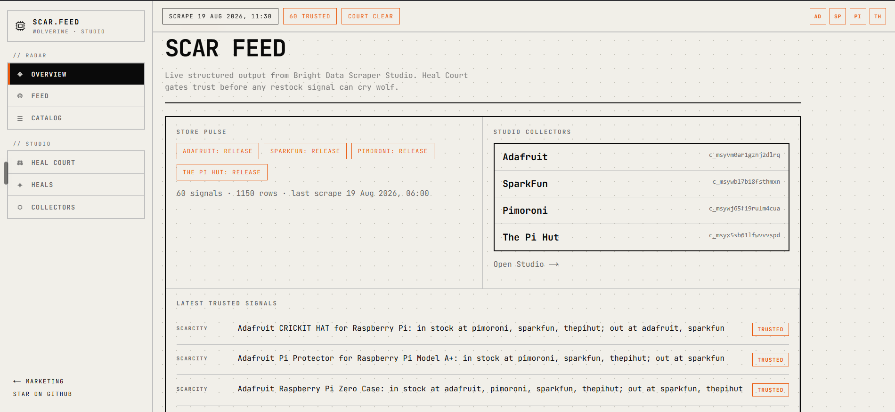
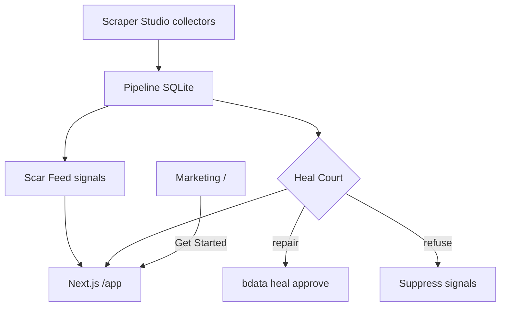

# Wolverine · Scar Feed

Restock radar for niche electronics that will not cry wolf when the scraper is lying.

Bright Data Scraper Studio collectors scrape Adafruit, SparkFun, Pimoroni, and The Pi Hut.
Scar Feed turns those snapshots into plain-English scarcity and restock signals.
Heal Court decides **release / repair / refuse** so a broken scraper cannot invent a restock.

**Live demo:** [https://wolverine-scraper.vercel.app](https://wolverine-scraper.vercel.app/) (Root Directory `web`) · [Docs](https://wolverine-scraper.vercel.app/docs) · [docs/DEPLOY.md](docs/DEPLOY.md)


## Try it

1. Open the **live demo**: [wolverine-scraper.vercel.app](https://wolverine-scraper.vercel.app/)
2. Enter **`/app`** — Field Console polls live `scar.json`; use **Run field scrape** (or [Actions](https://github.com/manasdutta04/wolverine-scraper/actions/workflows/scrape.yml)) to drive Studio via CI.
3. Read **[/docs](https://wolverine-scraper.vercel.app/docs)** for web, Docker, and local setup.
4. Or Docker:

```bash
docker pull manasdutta04/wolverine-dashboard:latest
docker run --rm -p 3000:3000 manasdutta04/wolverine-dashboard:latest
```

## Surfaces

| Path | Role |
| --- | --- |
| `/` | Marketing landing |
| `/app` | Product workspace overview |
| `/app/feed` | Scar Feed signals |
| `/app/court` | Heal Court |
| `/app/catalog` | Catalog |
| `/app/heals` | Heal journal |
| `/app/studio` | Pinned collectors + pipeline |
| `/docs` | Web, Docker, local, Studio docs |
| `/contact` | Links |

Legacy `/product`, `/feed`, `/court`, `/catalog`, `/case-studies` redirect into `/app/*`.

## Screenshots



## How Bright Data Scraper Studio is used

1. `bdata scraper create` built a custom collector per store (IDs pinned below - never recreate).
2. `bdata scraper run` returns structured JSON; `npm run scrape` writes `db/wolverine.db`.
3. Red flags go to **Heal Court**. Repair runs `bdata scraper heal` then `approve`. Refuse rejects a still-cloned preview.
4. GitHub Actions cron scrapes + heals + `scar:export` (commits `scar.json`). Optional `simulate_failure` proves detection without changing a live collector.
5. Public `/app` polls `scar.json` and can `workflow_dispatch` that job via optional Vercel `GITHUB_PAT` — **no Bright Data key on Vercel**.

Example output: [`examples/sample-output.json`](examples/sample-output.json) · Heal journal: [`heal-log.md`](heal-log.md)



## Collectors (do not recreate)

| Store | Collector | Listing URL |
| --- | --- | --- |
| Adafruit | `c_msyvm0ar1gznj2dlrq` | https://www.adafruit.com/category/105 |
| SparkFun | `c_msywbl7b18fsthmxn` | https://www.sparkfun.com/development-boards/single-board-computers/raspberry-pi.html |
| Pimoroni | `c_msywj65f19rulm4cua` | https://shop.pimoroni.com/collections/raspberry-pi |
| The Pi Hut | `c_msyx5sb61lfwvvvspd` | https://thepihut.com/collections/raspberry-pi |

## Local setup

```bash
git clone https://github.com/manasdutta04/wolverine-scraper.git
cd wolverine-scraper
npm install
cd web && npm install && cd ..

npm run scar:export
npm run web:dev
```

## Layout

| Path | Role |
| --- | --- |
| `scar/` | Match, diff, Heal Court gate, export, tests |
| `scrapers/` | Store registry + `bdata` runner |
| `pipeline/` | Scrape all stores → SQLite |
| `heal/` | Red-flag check + Court-aware heal loop |
| `web/` | Next.js: marketing `/` + product `/app` |
| `docs/` | Architecture, deploy notes |
| `.github/workflows/` | Cron scrape/heal + Releases |
| `SECURITY.md` | Secrets and reporting |

## AI assistance

Cursor was used to help write pipeline, Scar Feed, heal, CI, and UI code. Architecture, store choice, Collector IDs, heal prompts, and verification were directed by the author.

## Security

See [`SECURITY.md`](SECURITY.md). Public product data only. Keep `BRIGHTDATA_API_KEY` out of git and recordings.
