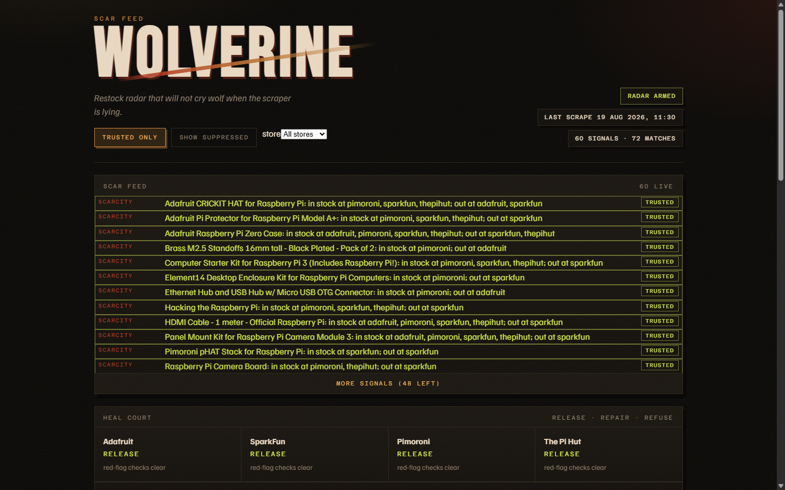
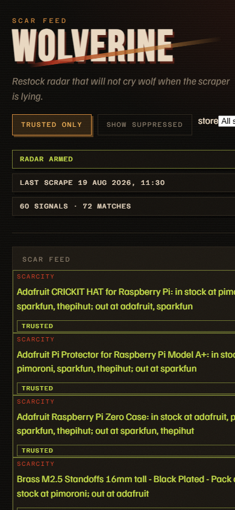
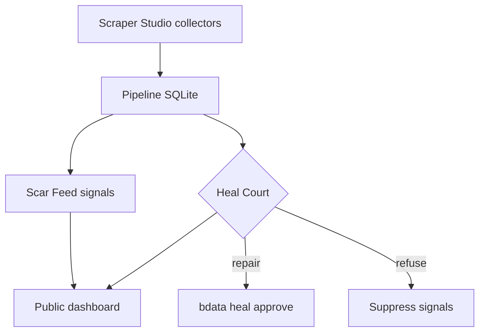

# Wolverine · Scar Feed

Restock radar for niche electronics that will not cry wolf when the scraper is lying.

Bright Data Scraper Studio collectors scrape Adafruit, SparkFun, Pimoroni, and The Pi Hut.
Scar Feed turns those snapshots into plain-English scarcity and restock signals.
Heal Court decides **release / repair / refuse** so a broken scraper cannot invent a restock.

**Live demo:** https://manasdutta04.github.io/wolverine-scraper/


## Try it without cloning

1. **Live demo (no install):** https://manasdutta04.github.io/wolverine-scraper/
2. **Docker (bundled snapshot):**

```bash
docker pull manasdutta04/wolverine-dashboard:latest
docker run --rm -p 3000:3000 manasdutta04/wolverine-dashboard:latest
```

Open http://localhost:3000

3. **Vercel (optional):** see [docs/DEPLOY.md](docs/DEPLOY.md) (`npx vercel login`, Root Directory `web`).
4. **Demo video:** _add YouTube / Loom link here_

## Screenshots

| Desktop | Mobile |
| --- | --- |
|  |  |

## How Bright Data Scraper Studio is used

1. `bdata scraper create` built a custom collector per store (IDs pinned below - never recreate).
2. `bdata scraper run` returns structured JSON; `npm run scrape` writes `db/wolverine.db`.
3. Red flags (empty prices, cloned price/stock) go to **Heal Court**. Repair runs `bdata scraper heal` then `approve`. Refuse rejects the proposal when the heal preview is still cloned.
4. GitHub Actions cron scrapes + heals. Optional `simulate_failure` proves detection without changing a live collector.
5. `npm run scar:export` writes `web/data/scar.json` for the public read-only demo (no Bright Data key on the site).

Example output: [`examples/sample-output.json`](examples/sample-output.json) · Heal journal: [`heal-log.md`](heal-log.md)



## Collectors (do not recreate)

| Store | Collector | Listing URL |
| --- | --- | --- |
| Adafruit | `c_msyvm0ar1gznj2dlrq` | https://www.adafruit.com/category/105 |
| SparkFun | `c_msywbl7b18fsthmxn` | https://www.sparkfun.com/development-boards/single-board-computers/raspberry-pi.html |
| Pimoroni | `c_msywj65f19rulm4cua` | https://shop.pimoroni.com/collections/raspberry-pi |
| The Pi Hut | `c_msyx5sb61lfwvvvspd` | https://thepihut.com/collections/raspberry-pi |

## Local setup

```bash
git clone https://github.com/manasdutta04/wolverine-scraper.git
cd wolverine-scraper
npm install
cd web && npm install && cd ..

# optional live scrape
export BRIGHTDATA_API_KEY=...   # never commit
npx --yes @brightdata/cli login --api-key "$BRIGHTDATA_API_KEY"
npm run scrape
npm run check
npm run heal                    # Heal Court on failures

npm run scar:export             # writes web/data/scar.json
npm run web:dev                 # http://localhost:3000
npm test
```

## Layout

| Path | Role |
| --- | --- |
| `scar/` | Match, diff, Heal Court gate, signal builder, export, tests |
| `scrapers/` | Store registry + `bdata` runner |
| `pipeline/` | Scrape all stores → SQLite |
| `heal/` | Red-flag check + Court-aware heal loop |
| `web/` | Next.js Scar Feed UI (static export for Pages/Docker) |
| `docs/` | Architecture graph, screenshots, deploy notes |
| `.github/workflows/` | Cron scrape/heal, Pages deploy, auto Releases |
| `SECURITY.md` | Secrets and reporting |

## AI assistance

Cursor was used to help write pipeline, Scar Feed, heal, CI, and UI code. Architecture, store choice, Collector IDs, heal prompts, and verification were directed by the author.

## Security

See [`SECURITY.md`](SECURITY.md). Public product data only. Keep `BRIGHTDATA_API_KEY` out of git and recordings.
